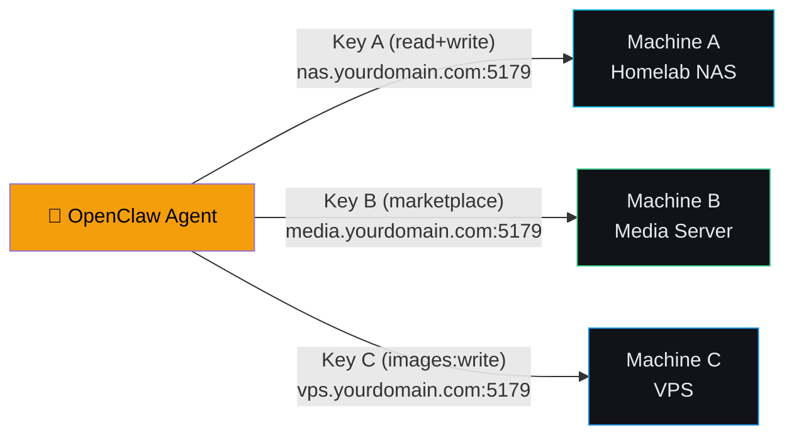
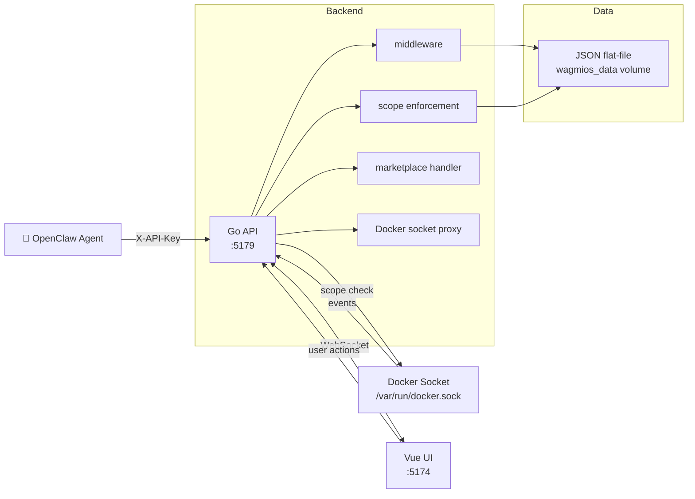

#  Wagmios

### Give your agent a homelab

[](https://opensource.org/licenses/MIT)
[](https://www.docker.com/)
[](https://golang.org/)

**WAGMIOS** is a self-hosted Docker management platform built native for **OpenClaw agents**. Give your agent a scoped API key and it can manage your homelab  --  install apps, start/stop containers, pull images  --  with every action visible and auditable. Scope = permission. No sudo, no daemon access, just the exact access you grant.

> **Think of it as your homelab's command center.** Built for folks who want the power of Docker without memorizing every CLI flag.

---

## ✨ What It Does

- WAGMIOS Marketplace  --  Install 34+ self-hosted apps in seconds. Plex, Jellyfin, Ollama, Home Assistant, and more.
- Container Management  --  List, create, start, stop, restart, and delete containers through a clean REST API.
- Scope-Based Permissions  --  Give AI agents exactly the permissions they need. Nothing blanket. If the key doesn't have `containers:delete`, the agent can't delete anything.
- OpenClaw-Native  --  Built for OpenClaw agents. Every action is visible and auditable.
- Real-Time Activity  --  WebSocket-powered activity feed shows you everything happening in your homelab.

---

## 🏃 Quick Start

### Option 1  --  Pull from Docker Hub (Recommended)

No build step. Images are pre-built for both x86_64 and ARM64.

```bash
# Download docker-compose.yaml
curl -O https://raw.githubusercontent.com/mentholmike/wagmios/main/docker-compose.yaml

# Start everything
docker compose up -d
```

### Option 2  --  Build from Source

Clone the repo and build locally with Docker.

```bash
git clone https://github.com/mentholmike/wagmios.git
cd wagmios
docker compose up -d --build
```

> **Note:** Building from source requires Docker on your machine. On ARM64 (Apple Silicon, ARM Linux) no extra setup is needed  --  the images build for both architectures automatically.

### 3. Open the UI

- Frontend  --  http://localhost:5174
- Backend API  --  http://localhost:5179
- Health  --  http://localhost:5179/health

### 4. Get Your API Key

On first launch, the Setup Wizard walks you through:
1. Name your API key (e.g. `openclaw-agent`, `home-assistant`)
2. Pick the permissions you want to grant
3. Copy your key and keep it safe

---

## 🔑 The Scope System Explained

Every WAGMIOS API key has **scopes**  --  granular permissions that control exactly what an agent can do.

```
┌─────────────────────────────────────────────────────────────┐
│  Your API Key Scopes                                        │
├─────────────────────────────────────────────────────────────┤
│  ✅ containers:read     → list containers, view logs        │
│  ✅ containers:write    → start, stop, create containers    │
│  ✅ containers:delete  → remove containers                  │
│  ✅ images:read        → list Docker images                 │
│  ✅ images:write       → pull and delete images             │
│  ✅ marketplace:read  → browse the app marketplace          │
│  ✅ marketplace:write → install and manage apps             │
└─────────────────────────────────────────────────────────────┘
```

**The rule is simple:** if the key doesn't have the scope, the API returns `SCOPE_REQUIRED`. The agent can't work around it.

---

## 🌐 Multi-Machine Management

WAGMIOS isn't just for one machine. Because the API is standard HTTP with an `X-API-Key` header, any OpenClaw agent that can reach your backend's port can manage that machine's Docker host  --  from anywhere.

**The model is simple:** one agent, many machines, each with its own scoped key.

### How It Works

1. Install WAGMIOS on each machine you want to manage
2. Each instance gets its own URL and its own set of API keys
3. Your agent holds one key per machine, each with only the scopes that machine needs
4. The agent can't cross machines, can't escalate its own permissions, and every action is logged in each instance's activity feed

> **Each WAGMIOS instance is fully independent.** There is no shared state, no cluster, no sync between instances. Each deployment is standalone.

### One Agent. Multiple Machines



**Example dialogue:**

> **User:** "Install Jellyfin on the media server and make sure Nginx is running on the NAS."

```
Agent → POST media.yourdomain.com:5179/api/marketplace/create { "app_id": "jellyfin" }
Agent → GET nas.yourdomain.com:5179/api/containers
Agent → POST nas.yourdomain.com:5179/api/containers/nginx-proxy/start

"Jellyfin is installing on the media server (port 8096). Nginx is running on the NAS."
```

### Skill Setup

Give your agent one key per machine, label them clearly. Each key lives in your agent's skill config:

```yaml
wagmios_instances:
  nas:
    url: http://192.168.1.10:5179
    key: wag_live_xxxxxxxxxxxx
    scopes: [containers:read, containers:write]
    label: "Homelab NAS"

  media:
    url: http://192.168.1.20:5179
    key: wag_live_yyyyyyyyyyyy
    scopes: [marketplace:read, marketplace:write]
    label: "Media Server"

  vps:
    url: https://vps.yourdomain.com:5179
    key: wag_live_zzzzzzzzzzzz
    scopes: [containers:read, images:write]
    label: "VPS"
```

The agent knows which URL to hit for which machine  --  and the scope system ensures it can only do what you've explicitly allowed on each one.

### Security: Network Exposure

WAGMIOS binds to all interfaces (`0.0.0.0`) by default. That's fine on a trusted LAN  --  but if you're exposing it beyond your local network, follow these steps first:

- Local LAN only  --  No extra steps. Keep port 5179 firewalled from the internet.
- Internet / VPN  --  Put a reverse proxy in front and terminate TLS there. Never send API keys over plain HTTP outside your LAN.

**Treat your WAGMIOS API key like an SSH key.** Over a trusted LAN it's fine. Over the open internet, always use TLS.

**Caddy (automatic HTTPS):**
```yaml
wagmios.yourdomain.com {
  reverse_proxy localhost:5179
}
```

**Nginx:**
```nginx
server {
  listen 443 ssl;
  server_name wagmios.yourdomain.com;

  location / {
    proxy_pass http://localhost:5179;
  }
}
```

---

## 🤖 For AI Agents

WAGMIOS is designed to be controlled by AI agents through its API.

**Example dialogue:**

```
User: "Delete the test-nginx container"
Agent: "I need containers:delete scope to do that. 
        Go to Settings → Agent Permissions → toggle ON containers:delete → Save.
        Let me know when it's enabled."

User: "Done."
Agent: *deletes the container* → "Done. Container deleted."
```

**What agents can do with WAGMIOS:**
- Install and manage apps from the marketplace
- Start/stop containers based on your requests
- Monitor your homelab's status
- Pull Docker images

**What agents should only do through WAGMIOS:**
- Access Docker (the skill makes every action visible and auditable)
- Escalate their own permissions
- Delete system containers (wagmios-backend, wagmios-frontend)
- Read/write files outside the containers directory

---

## 🏪 WAGMIOS Marketplace

Browse 34+ pre-configured apps at marketplace.wagmilabs.fun or directly in the app.

### Media & Entertainment

- Plex  --  Port 32400. Stream movies, TV, music to any device
- Jellyfin  --  Port 8096. Free, open-source media server
- Immich  --  Port 2283. Self-hosted photo backup from your phone

### Home Automation

- Home Assistant  --  Port 8123. Open source smart home platform

### AI & Local Models

- Ollama  --  Port 11434. Run LLaMA, Mistral, and other open-source AI models locally
- Open WebUI  --  Port 8080. Chat interface for Ollama

###arr Stack

- Sonarr  --  Port 8989. Automatically download TV shows
- Radarr  --  Port 7878. Automatically download movies
- Prowlarr  --  Port 9696. Manage all your torrent indexers in one place

### Monitoring

- Uptime Kuma  --  Port 3001. Beautiful server monitoring dashboard
- Grafana  --  Port 3000. Visualize metrics and logs
- Prometheus  --  Port 9090. Time series database for metrics

### Security

- Vaultwarden  --  Port 80. Self-hosted Bitwarden password manager

### Networking

- Nginx  --  Port 80. Web server and reverse proxy
- Pi-hole  --  Port 80. Block ads network-wide
- AdGuard Home  --  Port 3000. DNS-level ad blocking
- WireGuard  --  Port 51820. Fast, modern VPN |

### And More
Transmission, qBittorrent, Nextcloud, Filebrowser, Minecraft, n8n, RSSHub, and more.

---

## 🛠️ API Reference

**Base URL:** `http://localhost:5179`

**Auth:** All requests require the `X-API-Key` header.

### Containers

- List  --  `GET /api/containers`  --  requires `containers:read`
- Logs  --  `GET /api/containers/{id}/logs`  --  requires `containers:read`
- Start  --  `POST /api/containers/{id}/start`  --  requires `containers:write`
- Stop  --  `POST /api/containers/{id}/stop`  --  requires `containers:write`
- Restart  --  `POST /api/containers/{id}/restart`  --  requires `containers:write`
- Delete  --  `DELETE /api/containers/{id}/delete`  --  requires `containers:delete`

### Images

- List  --  `GET /api/images`  --  requires `images:read`
- Pull  --  `POST /api/images/pull`  --  requires `images:write`
- Delete  --  `DELETE /api/images/{id}`  --  requires `images:write`

### Marketplace

- Browse  --  `GET /api/marketplace`  --  requires `marketplace:read`
- Install  --  `POST /api/marketplace/create`  --  requires `marketplace:write`
- Start  --  `POST /api/marketplace/start`  --  requires `marketplace:write`

### Auth

- Status  --  `GET /api/auth/status`  --  Check key scopes
- Settings  --  `GET /api/settings`  --  Key metadata

---

## 🐳 Docker Management

### Start / Stop

```bash
# Start
docker compose up -d

# Stop
docker compose down

# View logs
docker compose logs -f backend
docker compose logs -f frontend
```

### Updating

**If you used Option 1 (Docker Hub):**
```bash
docker compose down
docker compose pull
docker compose up -d
```

**If you built from source:**
```bash
docker compose down
docker compose pull  # fetch latest Hub images
docker compose up -d --build
```

### Data Persistence

WAGMIOS uses named Docker volumes:

- wagmios_data -- API keys, settings, app data
- frontend_data -- Frontend assets

Marketplace apps are stored in `~/.wagmios/containers/` on the host.

### Environment Variables

- PORT -- Default: 5179 -- Backend port
- WAGMIOS_DATA_DIR -- Default: /app/data -- Data directory
- VITE_API_URL -- Frontend to Backend URL (auto-set in compose)

---

## 🏗️ Architecture



### Tech Stack

- Backend  --  Go (`net/http`, `gorilla/mux`)
- Frontend  --  Vue 3 + Vite + TypeScript
- Database  --  JSON flat-files (keys, settings)
- Container Runtime  --  Docker (via socket)
- UI  --  Tailwind CSS, custom dark mode

See the [full tech stack page](https://wiki.wagmilabs.fun/stack.html) for dependencies, versions, and scope system reference.

---

## 📁 Project Structure

```
wagmios/
├── backend-go/          # Go API server
│   └── internal/
│       ├── api/         # Container/image endpoints
│       ├── auth/        # Key store, middleware, scope validation
│       ├── marketplace/ # App catalog and install handlers
│       └── activity/   # WebSocket activity feed
├── frontend/            # Vue.js UI
│   └── src/
│       ├── components/  # Vue components
│       ├── api.ts       # API client
│       └── App.vue      # Main app
├── logo/                # Project logos
├── docker-compose.yaml  # Run instructions
├── Dockerfile.backend    # Backend build
└── Dockerfile.frontend  # Frontend build
```

---

## 🤝 Contributing

Contributions welcome! Whether it's:
- Reporting a bug
- Suggesting a new marketplace app
- Submitting a PR

Open an issue or PR on GitHub.

---

## 📄 License

MIT License  --  do what you want with it.

---

## 🤖 OpenClaw Skill

Give your OpenClaw agent a homelab. Install the skill directly into your agent:

```bash
/clawhub install wagmios
```

The skill tells your agent how to:
- Authenticate with WAGMIOS using your API key
- List, start, stop, and manage containers
- Browse and install apps from the WAGMIOS Marketplace
- Pull and manage Docker images
- Work within scope-based permissions (no sudo, no workarounds)

> **Your agent needs an API key with the right scopes to use WAGMIOS.** The skill will guide key setup on first use.

---

## 🔗 Links

- Main Repo  --  https://github.com/mentholmike/wagmios
- Marketplace  --  https://marketplace.wagmilabs.fun
- Documentation  --  https://wiki.wagmilabs.fun
- OpenClaw Skill  --  https://clawhub.ai/mentholmike/wagmios
- Docker Hub  --  https://hub.docker.com/r/itzmizzle/wagmi
- Issues  --  https://github.com/mentholmike/wagmios/issues

---

<p align="center">
  
</p>

<p align="center">
  <em>🤖 🤝 🦞</em>
</p>
